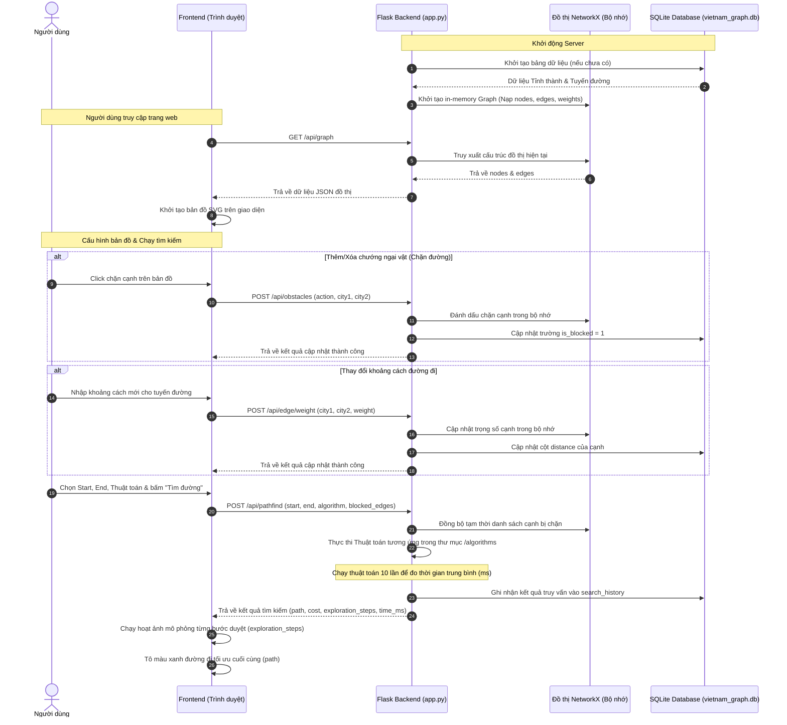

# 🗺️ A* Pathfinding Visualization - Bản đồ Việt Nam

Ứng dụng web trực quan hóa các thuật toán tìm đường đi ngắn nhất trên đồ thị đường bộ bản đồ Việt Nam (34 tỉnh thành và vùng đặc khu hành chính). Chương trình cho phép người dùng cấu hình điểm xuất phát/đích, đặt chướng ngại vật (chặn đường), cập nhật khoảng cách, trực quan hóa từng bước suy nghĩ của thuật toán, và so sánh hiệu suất giữa 6 thuật toán tìm kiếm phổ biến.

---

## 🛠️ Công nghệ & Thư viện sử dụng

### 1. Backend
Hệ thống Backend được xây dựng dưới dạng REST API sử dụng Python:
- **Ngôn ngữ**: [Python 3](https://www.python.org/)
- **Web Framework**: [Flask (v3.1.1)](file:///c:/Users/thesh/Ki%201%202026-2027/Artificial%20Intelligence/src/backend/requirements.txt) - Xây dựng các REST API endpoint nhanh chóng, xử lý routing, và serve tài nguyên frontend.
- **Bảo mật & Chia sẻ tài nguyên**: [Flask-CORS (v5.0.0)](file:///c:/Users/thesh/Ki%201%202026-2027/Artificial%20Intelligence/src/backend/requirements.txt) - Cấu hình Cross-Origin Resource Sharing để frontend gọi API từ các origin khác.
- **Xử lý Đồ thị**: [NetworkX (v3.4.2)](file:///c:/Users/thesh/Ki%201%202026-2027/Artificial%20Intelligence/src/backend/requirements.txt) - Quản lý cấu trúc dữ liệu đồ thị (nodes, edges, weights) một cách hiệu quả trong bộ nhớ.
- **Xử lý Số liệu**: [NumPy (v2.2.6)](file:///c:/Users/thesh/Ki%201%202026-2027/Artificial%20Intelligence/src/backend/requirements.txt) - Hỗ trợ các cấu trúc tính toán số học.
- **Cơ sở dữ liệu**: [SQLite3](file:///c:/Users/thesh/Ki%201%202026-2027/Artificial%20Intelligence/src/backend/database/db.py) (Sử dụng thư viện tích hợp sẵn `sqlite3` của Python) - Lưu trữ danh sách tỉnh thành, các kết nối đường đi, trạng thái chướng ngại vật thực tế và lịch sử truy vấn tìm đường của người dùng.

### 2. Frontend
Giao diện trực quan hóa và tương tác người dùng:
- **Cấu trúc giao diện**: `HTML5` - Khai báo layout chia vùng điều khiển (sidebar) và bản đồ tương tác.
- **Thiết kế & Hoạt ảnh**: `CSS3` - Sử dụng các kỹ thuật thiết kế hiện đại (Glassmorphism, Gradient, Flexbox, Grid) kết hợp với CSS Keyframes cho hoạt ảnh tìm đường sinh động.
- **Logic & Tương tác**: `Vanilla JavaScript` (ES6+) - Xử lý bắt sự kiện từ chuột, kết nối AJAX (Fetch API) để giao tiếp với backend, điều khiển tiến độ chạy hoạt ảnh trực quan hóa.
- **Bản đồ trực quan**: `SVG` (Scalable Vector Graphics) kết hợp dữ liệu tọa độ ranh giới tỉnh thành `GeoJSON` ([vietnam_geojson.js](file:///c:/Users/thesh/Ki%201%202026-2027/Artificial%20Intelligence/src/frontend/js/vietnam_geojson.js)) để vẽ bản đồ đất nước một cách sắc nét, hỗ trợ zoom, pan và chọn địa điểm trực quan.

---

## 🔄 Sơ đồ luồng hoạt động (System Flow)

> [!TIP]
> Bạn có thể mở và chỉnh sửa trực quan các sơ đồ dưới đây bằng phần mềm Draw.io bằng cách mở các file:
> * 1. Khởi động hệ thống: [02_system_startup.drawio](file:///c:/Users/thesh/Ki%201%202026-2027/Artificial%20Intelligence/src/draw.io/02_system_startup.drawio)
> * 2. Luồng xử lý tìm đường: [03_pathfinding_process.drawio](file:///c:/Users/thesh/Ki%201%202026-2027/Artificial%20Intelligence/src/draw.io/03_pathfinding_process.drawio)
> * 3. Thuật toán tìm kiếm A*: [01_astar.drawio](file:///c:/Users/thesh/Ki%201%202026-2027/Artificial%20Intelligence/src/draw.io/01_astar.drawio)

Dưới đây là sơ đồ tương tác tuần tự giữa các thành phần khi hệ thống vận hành:




### 🧠 Luồng xử lý thuật toán tìm kiếm (Search Flowchart)
Sơ đồ mô tả quy trình duyệt tìm đường đi ngắn nhất ở Backend:

```mermaid
flowchart TD
    Start([Bắt đầu tìm kiếm]) --> Init[Khởi tạo Open List hàng đợi ưu tiên & Closed List tập đã duyệt]
    Init --> CheckAlgo{Thuật toán thuộc nhóm nào?}
    
    CheckAlgo -- Có thông tin (A*, Greedy) --> CalcH[Tính khoảng cách Haversine làm Heuristic h(n) nhân 0.6]
    CheckAlgo -- Không thông tin (Dijkstra, BFS, DFS, UCS) --> ZeroH[Đặt heuristic h(n) = 0]
    
    CalcH --> Loop{Open List rỗng?}
    ZeroH --> Loop
    
    Loop -- Đúng --> Fail([Không tìm thấy đường đi])
    Loop -- Sai --> Pop[Lấy node n có f(n) = g(n) + h(n) nhỏ nhất ra khỏi Open List]
    
    Pop --> Visit{n đã duyệt?}
    Visit -- Đúng --> Loop
    Visit -- Sai --> Mark[Đánh dấu n là đã duyệt & lưu bước duyệt vào exploration_steps]
    
    Mark --> Target{n == Đích?}
    Target -- Đúng --> Success([Đo thời gian trung bình & Lưu lịch sử vào SQLite])
    Success --> End([Trả về kết quả tìm thấy đường])
    
    Target -- Sai --> Expand[Duyệt các node kề m của n]
    
    Expand --> Neighbors{Hết node kề?}
    Neighbors -- Đúng --> Loop
    Neighbors -- Sai --> Filter{m đã duyệt OR đường đi n-m bị chặn?}
    
    Filter -- Đúng --> Neighbors
    Filter -- Sai --> UpdateG[Tính g(m) mới = g(n) + d(n, m)]
    
    UpdateG --> CheckBetter{m chưa trong Open List OR g(m) mới < g(m) cũ?}
    CheckBetter -- Sai --> Neighbors
    CheckBetter -- Đúng --> Push[Cập nhật g(m), tính f(m) & thêm m vào Open List]
    Push --> Neighbors
```

---

## 🔀 Chi tiết Dữ liệu Input & Output của API

### 1. Lấy dữ liệu đồ thị Việt Nam (`GET /api/graph`)
* **Mục đích**: Cung cấp cấu trúc mạng lưới giao thông 34 tỉnh thành để vẽ đồ họa bản đồ.
* **Input**: Không có tham số đầu vào.
* **Output (JSON)**:
  ```json
  {
    "metadata": { "description": "Bản đồ giao thông Việt Nam" },
    "nodes": [
      { "id": 1, "name": "Hà Nội", "lat": 21.0285, "lng": 105.8542, "type": "province", "region": "North" },
      ...
    ],
    "edges": [
      { "from": "Hà Nội", "to": "Ninh Bình", "distance": 93.5, "blocked": false },
      ...
    ]
  }
  ```

### 2. Tìm kiếm đường đi (`POST /api/pathfind`)
* **Mục đích**: Chạy thuật toán tìm đường được chỉ định và thu thập dữ liệu các bước để trực quan hóa.
* **Input (JSON)**:
  ```json
  {
    "start": "Hà Nội",
    "end": "Hồ Chí Minh",
    "algorithm": "astar",
    "blocked_edges": [["Thanh Hóa", "Vinh"]]
  }
  ```
* **Output (JSON)**:
  ```json
  {
    "algorithm": "A*",
    "type": "informed",
    "path": ["Hà Nội", "Ninh Bình", "Hòa Bình", "Vinh", ..., "Hồ Chí Minh"],
    "cost": 1720.5,
    "explored_count": 18,
    "exploration_steps": [
      {
        "step": 1,
        "current": "Hà Nội",
        "frontier": ["Bắc Ninh", "Hải Phòng", "Ninh Bình", "Hòa Bình"],
        "visited": ["Hà Nội"],
        "current_path": ["Hà Nội"],
        "current_cost": 0,
        "f_cost": 980.5
      },
      ...
    ],
    "time_ms": 0.1245
  }
  ```

### 3. So sánh thuật toán (`POST /api/compare`)
* **Mục đích**: Thực thi đồng thời cả 6 thuật toán tìm đường trên cùng một bài toán đầu vào để so sánh số liệu hiệu năng.
* **Input (JSON)**:
  ```json
  {
    "start": "Hà Nội",
    "end": "Hồ Chí Minh",
    "blocked_edges": []
  }
  ```
* **Output (JSON)**:
  ```json
  {
    "results": [
      {
        "algorithm": "A*",
        "type": "informed",
        "path": ["Hà Nội", ..., "Hồ Chí Minh"],
        "cost": 1720.5,
        "explored_count": 18,
        "steps_count": 18,
        "time_ms": 0.115
      },
      {
        "algorithm": "Dijkstra",
        "type": "uninformed",
        "path": ["Hà Nội", ..., "Hồ Chí Minh"],
        "cost": 1720.5,
        "explored_count": 34,
        "steps_count": 34,
        "time_ms": 0.182
      },
      ...
    ]
  }
  ```

### 4. Quản lý chướng ngại vật (`POST /api/obstacles`)
* **Mục đích**: Thêm hoặc hủy bỏ chướng ngại vật trên các cung đường liên tỉnh.
* **Input (JSON)**:
  ```json
  {
    "action": "block",
    "city1": "Thanh Hóa",
    "city2": "Vinh"
  }
  ```
* **Output (JSON)**:
  ```json
  {
    "message": "Đã chặn đường Thanh Hóa - Vinh"
  }
  ```

### 5. Cập nhật khoảng cách đường (`POST /api/edge/weight`)
* **Mục đích**: Cập nhật trọng số khoảng cách (km) giữa hai tỉnh thành.
* **Input (JSON)**:
  ```json
  {
    "city1": "Hà Nội",
    "city2": "Ninh Bình",
    "weight": 120.0
  }
  ```
* **Output (JSON)**:
  ```json
  {
    "message": "Đã cập nhật khoảng cách Hà Nội - Ninh Bình thành 120.0km"
  }
  ```

### 6. Lấy lịch sử tìm kiếm (`GET /api/history`)
* **Mục đích**: Xem các lượt tìm đường được thực hiện trước đó đã lưu vào SQLite.
* **Input**: Query Parameter `limit=50` (Mặc định là 50 bản ghi gần nhất).
* **Output (JSON)**:
  ```json
  {
    "history": [
      {
        "id": 5,
        "algorithm": "A*",
        "start_city": "Hà Nội",
        "end_city": "Hồ Chí Minh",
        "path": "[\"Hà Nội\", ..., \"Hồ Chí Minh\"]",
        "distance": 1720.5,
        "time_ms": 0.1245,
        "nodes_explored": 18,
        "steps_count": 18,
        "timestamp": "2026-07-11T13:10:00"
      },
      ...
    ]
  }
  ```

---

## 🚀 Hướng dẫn chạy chương trình

### 1. Cài đặt các thư viện cần thiết (Backend)
Truy cập vào thư mục backend và cài đặt dependencies từ file [requirements.txt](file:///c:/Users/thesh/Ki%201%202026-2027/Artificial%20Intelligence/src/backend/requirements.txt):
```bash
cd src/backend
pip install -r requirements.txt
```

### 2. Chạy ứng dụng Backend
Khởi chạy Flask server:
```bash
python app.py
```
Server Flask sẽ lắng nghe tại: `http://localhost:5000`

### 3. Mở giao diện Frontend
Vì backend Flask đã được cấu hình serve các file tĩnh từ thư mục frontend, bạn có thể truy cập thẳng vào trang chủ:
- URL: `http://localhost:5000/` hoặc `http://localhost:5000/index.html`
- (Hoặc) Bạn có thể click đúp mở trực tiếp file [index.html](file:///c:/Users/thesh/Ki%201%202026-2027/Artificial%20Intelligence/src/frontend/index.html) bằng trình duyệt hoặc sử dụng extension Live Server trong VS Code.

---

## 📁 Cấu trúc thư mục dự án

```
src/
├── backend/
│   ├── app.py                  # API Server Flask điều hướng chính
│   ├── requirements.txt        # Danh sách thư viện Python cần dùng
│   ├── algorithms/             # 6 thuật toán tìm kiếm đường đi
│   │   ├── astar.py            # Thuật toán A* Search (Informed)
│   │   ├── bfs.py              # Thuật toán Breadth-First Search (Uninformed)
│   │   ├── dfs.py              # Thuật toán Depth-First Search (Uninformed)
│   │   ├── dijkstra.py         # Thuật toán Dijkstra ngắn nhất cổ điển
│   │   ├── greedy.py           # Thuật toán Greedy Best-First Search (Informed)
│   │   ├── ucs.py              # Thuật toán Uniform Cost Search (Uninformed)
│   │   └── heuristics.py       # Khoảng cách Haversine (Độ cong Trái Đất) làm Heuristic
│   ├── models/
│   │   └── graph_model.py      # NetworkX Graph quản lý dữ liệu bản đồ trong bộ nhớ
│   ├── database/
│   │   └── db.py               # Thao tác SQLite (bảng cities, edges, search_history)
│   └── data/
│       ├── vietnam_cities.json # File JSON tĩnh chứa danh sách tỉnh & đường nối mặc định
│       └── vietnam_graph.db    # Cơ sở dữ liệu SQLite thực tế được tạo ra
│
└── frontend/
    ├── index.html              # Trang giao diện HTML chính
    ├── css/
    │   ├── style.css           # Cấu trúc styles nền tảng
    │   ├── map.css             # Cấu trúc vẽ các đường nối, tỉnh lỵ và chặn đường bản đồ
    │   └── animations.css      # Hoạt ảnh hiệu ứng nhấp nháy, di chuyển tìm đường
    └── js/
        ├── app.js              # Khởi tạo bản đồ, bắt sự kiện chuột & điều phối UI chính
        ├── map.js              # Bản vẽ SVG bản đồ Việt Nam, zoom & pan
        ├── vietnam_geojson.js  # Tọa độ GeoJSON hỗ trợ đồ họa địa lý Việt Nam
        ├── algorithms.js       # Các hàm gọi API tới Flask backend qua fetch
        ├── visualization.js    # Logic trực quan hóa hoạt ảnh animation từng bước duyệt đồ thị
        └── comparison.js       # Xử lý giao diện biểu đồ và bảng so sánh kết quả các thuật toán
```

---

## 👤 Tác giả
- **Trần Trung Hiếu**
- Đề tài: *Xây dựng chương trình tìm đường đi ngắn nhất trên đồ thị bằng thuật toán A\** (và so sánh với các thuật toán khác).
